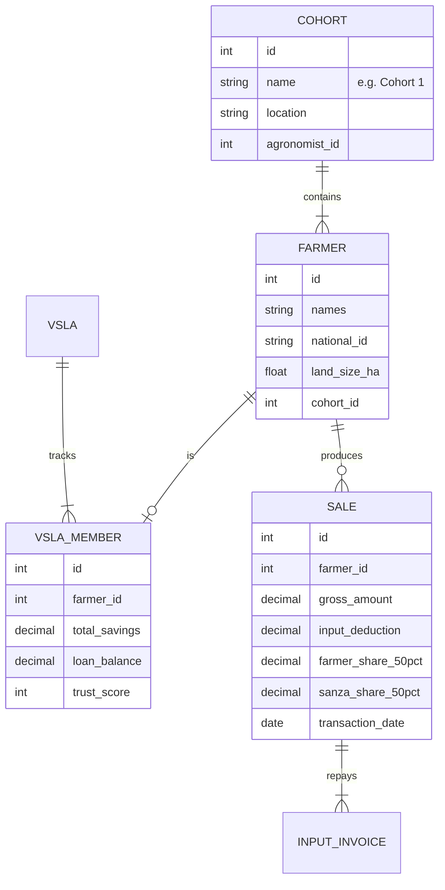
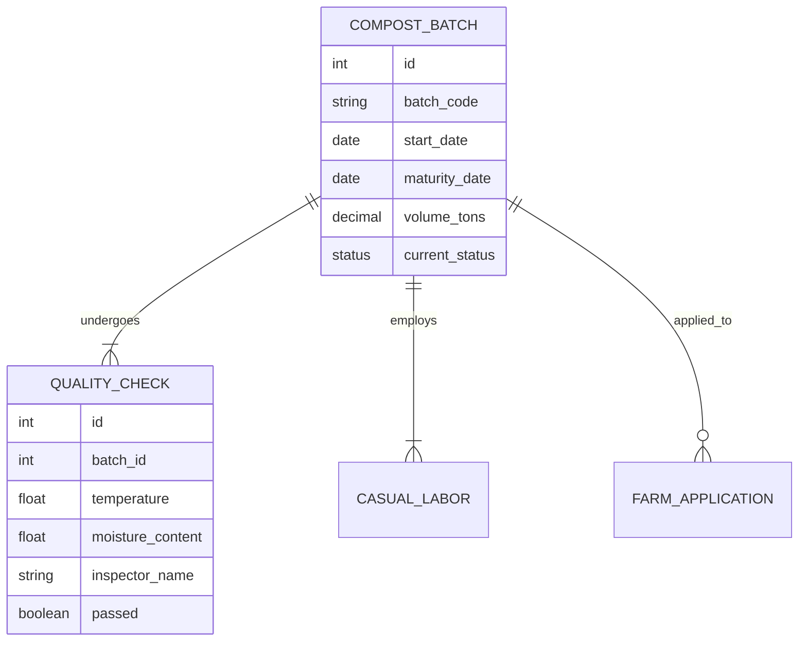

# 🌍 Project AAYWA & PARTNERS: The Comprehensive Digital Ecosystem

**Version:** 4.1 (Roadmap & Enhancement Edition)  
**Date:** February 9, 2026  
**Status:** Operational / Phase 1 Deployment  
**Alignment:** Strictly Aligned with "AAYWA PROJECT - DUFATANYE TUGABANE" Concept Note

---

## 1. Executive Summary & Strategic Alignment

**Project AAYWA** is a transformative social business initiative in Rwanda designed to empower 100 young women and adolescent mothers through nutrition-sensitive agriculture. The project is built on three pillars: **secure land access**, **organic fertilizer production**, and **financial inclusion** via Village Savings and Loan Associations (VSLAs).

The **AAYWA Platform** is the digital backbone of this initiative. It is not merely a record-keeping tool but a "Transparency Engine" that ensures:
1.  **Traceability**: From the raw manure inputs in the compost piles to the final avocado sold in Kigali, every step is digitally logged.
2.  **Financial Integrity**: The platform automates the critical **50/50 profit-sharing model** mandated by the concept note, ensuring that after input costs are recovered, profits are split fairly and transparently between the farmers and Sanza Alkebulan.
3.  **Governance**: By digitizing VSLA metrics (savings, loans, trust scores), the platform creates a credit history for previously unbanked women, unlocking future economic opportunities.

This document provides a complete technical deep-dive into the platform's architecture, including the full file structure, database schemas, API documentation, and module-by-module breakdown.

---

## 2. System Architecture

The platform follows a modern **Monorepo** structure, separating concerns into three distinct applications that share a common data source. We utilize the MERN stack (MongoDB/PostgreSQL, Express, React, Node.js) for its JSON-native capabilities and scalability.

```mermaid
graph TD
    User((User/Farmer/Buyer))
    
    subgraph "Frontend Layer"
        Website[Public Website\n(React + Tailwind)]
        Dashboard[Operational Dashboard\n(React + TypeScript)]
    end
    
    subgraph "Backend Layer"
        API[Node.js + Express API\n(REST Architecture)]
        Auth[JWT Authentication\n& RBAC Middleware]
    end
    
    subgraph "Data Layer"
        DB[(PostgreSQL / MongoDB\nHybrid Data Store)]
        Files[File Storage\n(Images/Docs)]
    end
    
    User -->|Visits| Website
    User -->|Manages| Dashboard
    Website -->|Requests| API
    Dashboard -->|Requests| API
    API -->|Queries| DB
    API -->|Validates| Auth
```

---

## 3. Comprehensive Project Structure

The codebase is organized into four primary directories: `website`, `web-dashboard`, `backend`, and `database`.

### 3.1 📂 `website`: The Public Face
Located at `c:\Users\educa\OneDrive\Desktop\aaywa platform\website`. This portal drives market access and partnership credibility.

*   **src/pages/**
    *   `Home.tsx`: The primary landing page. Features the "Young Women. Land. Dignity." hero section.
    *   `AboutPage.tsx`: Details the governance structure (Board, Effective Members).
    *   `ModelPage.tsx`: Explains the "Lease → Farm → Sell → Share" business model.
    *   `Marketplace.tsx`: B2B e-commerce interface for wholesale buyers (e.g., Afro Source).
    *   `ContactPage.tsx`: Innovative routing form for Partners vs. Buyers.
    *   `Blog.tsx`: Updates on cohort progress.
*   **src/components/**
    *   `home/`: `Hero.tsx`, `Impact.tsx` (real-time metrics), `Partners.tsx`, `InteractiveMap.tsx`.
    *   `model/`: `ModelHero.tsx` (visual timeline).
    *   `marketplace/`: `ProductCard.tsx`, `CartDrawer.tsx` (quote request system), `CheckoutForm.tsx`.
    *   `layout/`: `Header.tsx`, `Footer.tsx`.
*   **config/**
    *   `tailwind.config.js`: Custom colors (`brand-blue`, `brand-gold`).

### 3.2 📂 `web-dashboard`: The Operational Engine
Located at `c:\Users\educa\OneDrive\Desktop\aaywa platform\web-dashboard`. Restricted access for Agronomists and Officers.

*   **src/pages/**
    *   `Dashboard.tsx`: High-level KPI view (Total Harvest, Active Cohorts, VSLA Savings).
    *   `FarmersPage.tsx`: Digital profiles for all 100 beneficiaries.
    *   `VSLA.tsx`: **Critical Module**. Tracks weekly savings, loan cycles, and "Trust Scores".
    *   `CompostPage.tsx`: Logs organic fertilizer production batches and quality metrics (moisture, temp).
    *   `InputsSalesPage.tsx`: Manages inventory (seeds, tools) and sales recording.
    *   `MapsPage.tsx`: GIS interface using Leaflet to show farm polygons.
    *   `CohortsPage.tsx`: Aggregated view of the 4 cohorts (25 members each).
    *   `TrainingPage.tsx`: Tracks "Training of Trainers" (ToT) attendance and certification.
    *   `OrdersPage.tsx`: Management of incoming orders from the website.
    *   `UsersPage.tsx`: Admin management for system users (RBAC).
*   **src/components/**
    *   `vsla/`: `MemberFinancialTable.tsx`, `TransactionFormModal.tsx`, `VSLAHealthMetrics.tsx`, `OfficerManagementCard.tsx`.
    *   `compost/`: `BatchList.tsx`, `QualityControlForm.tsx`, `StipendManagement.tsx` (tracks €2.50/day payments).
    *   `warehouse/`: `InventoryTable.tsx`, `StockMovementForm.tsx`.
    *   `maps/`: `FarmMap.tsx`, `GeoInformatics.tsx`.
    *   `alerts/`: `AlertsDropdown.tsx`.

### 3.3 📂 `backend`: The Logic Core
Located at `c:\Users\educa\OneDrive\Desktop\aaywa platform\backend`. Node.js/Express server.

*   **src/controllers/**
    *   `saleController.js`: **Core Logic**. Automates the 50/50 profit split.
    *   `vslaController.js`: Calculates member creditworthiness.
    *   `compostController.js`: Manages fertilizer batch lifecycles.
    *   `farmerController.js`: CRUD operations for beneficiaries.
    *   `authController.js`: JWT generation and login logic.
    *   `dashboardController.js`: KPI aggregation.
*   **src/models/**
    *   `Farmer.js`, `Cohort.js`, `VSLA.js`, `Compost.js`, `Sale.js`, `InputInvoice.js`, `Product.js`, `Order.js`, `User.js`, `Training.js`, `Warehouse.js`.
*   **src/routes/**
    *   `sales.routes.js`, `vsla.routes.js`, `compost.routes.js` link controllers to endpoints.
*   **src/middleware/**
    *   `roleGuard.js`: Enforces RBAC settings.
    *   `auth.js`: Verifies JWT tokens.
*   **src/services/**
    *   `profitShareCalculator.js`: Shared service that executes the net revenue division logic.

### 3.4 📂 `database`: The Data Foundation
Located at `c:\Users\educa\OneDrive\Desktop\aaywa platform\database`.

*   `schema.sql`: Core PostgreSQL table definitions.
*   `compost_schema.sql`: Tables for `compost_batches` and `quality_checks`.
*   `maps_schema.sql`: PostGIS enabled tables for farm boundaries.
*   `warehouse_schema.sql`: Inventory tracking tables.
*   `alerts_schema.sql`: System notification triggers.

---

## 4. API Documentation

The backend exposes a RESTful API. Below are the key endpoints powering the system.

| Method | Endpoint | Description | Access Control |
| :--- | :--- | :--- | :--- |
| **AUTH** | | | |
| `POST` | `/api/auth/login` | Authenticates user and returns JWT. | Public |
| `POST` | `/api/auth/register` | Creates a new admin/staff account. | Admin Only |
| **VSLA** | | | |
| `GET` | `/api/vsla/:id` | Returns group details and aggregate savings. | Staff |
| `POST` | `/api/vsla/:id/transactions` | Records a deposit/withdrawal. Updates member balance. | Officer |
| `GET` | `/api/vsla/:id/metrics` | Returns calculated Trust Scores. | Staff |
| **SALES** | | | |
| `POST` | `/api/sales` | Records a sale. **Triggers 50/50 split logic.** | Agronomist |
| `GET` | `/api/sales/revenue` | Returns Sanza vs. Farmer revenue share. | Admin |
| **COMPOST** | | | |
| `POST` | `/api/compost/batch` | Creates a new fertilizer batch. | Agronomist |
| `POST` | `/api/compost/quality` | Logs moisture/temp check. Triggers bonus if valid. | Agronomist |

---

## 5. Database Schema Diagrams

### 5.1 Core Beneficiary & Financial Schema
Detailed relationship between Farmers, Cohorts, and the Financial (VSLA/Sales) systems.



### 5.2 Compost & Production Schema
Tracks the organic fertilizer value chain, linking production batches to the casual workers (stipends).



---

## 6. Module Deep Dives & Business Logic

### 6.1 The 50/50 Profit Share Engine (`saleController.js` & `profitShareCalculator.js`)
This is the financial heart of the social business.
*   **Input Recovery First**: When a sale happens (e.g., 100kg Avocados for 100,000 RWF), the system checks `InputInvoice` table. If the farmer owes 20,000 RWF for seeds, this is deducted first.
*   **Split**: The remaining 80,000 RWF is split: 40,000 to the Farmer's wallet, 40,000 to Sanza Alkebulan.
*   **Transparency**: The farmer receives a generated digital receipt showing exactly where every franc went.

### 6.2 The Digital VSLA (`VSLA.tsx`)
This module promotes financial inclusion.
*   **Seed Capital**: The system logs the initial €10 injection per member as a "Special Deposit" that cannot be withdrawn immediately but serves as loan collateral.
*   **Trust Score Algorithm**: We calculate a score (0-100) based on:
    *   *Consistency*: Deposits made every week vs. sporadic.
    *   *Repayment*: On-time loan repayments.
    *   This score allows high-performing farmers to access larger input loans for the next season.

### 6.3 Organic Fertilizer Traceability (`CompostPage.tsx`)
Ensures the "Organic" promise is kept.
*   **Batch Tracking**: Every pile is tracked from "Turning" to "Mature".
*   **Stipend Management**: Logs the days worked by adolescent mothers. The system alerts if a payment is due (e.g., end of month), ensuring timely €2.50/day payments.

---

## 7. Future Roadmap & Remaining Enhancements

To fully realize the vision of the DRAFT 3 Concept Note and reach enterprise scale, the following technical enhancements are scheduled for Phase 2:

### 7.1 📱 Mobile App Completion (Critical for Field Ops)
*   **Current Status**: Scaffolded (`mobile-app/lib/main.dart` initialized).
*   **Required Action**: Develop offline-first forms for:
    *   Geolocating farm plots (using phone GPS).
    *   Logging attendance at trainings (by scanning QR codes on farmer ID cards).
    *   Recording sales directly at the collection center.
*   **Tech Stack**: Flutter + SQLite (local db) + Background Sync.

### 7.2 📠 Automated Reporting
*   **Current Status**: Mocked in `vslaController.js` (`generateStatements`).
*   **Required Action**: Integrate `pdfkit` or `Puppeteer` to generate real, downloadable PDF statements for farmers.
*   **Required Action**: Integrate `Africa's Talking` SMS API to send weekly balance summaries to members' feature phones.

### 7.3 📡 IoT Soil Sensors
*   **Current Status**: Planned.
*   **Required Action**: Create a new API endpoint `/api/sensors/ingest` to receive data from LoRaWAN soil moisture sensors. This will replace manual "Quality Control" logs in `CompostPage.tsx`.

### 7.4 🧪 Comprehensive Testing
*   **Current Status**: Manual testing only.
*   **Required Action**: Implement `Jest` unit tests for the critical `profitShareCalculator.js` to ensure the 50/50 split never fails.
*   **Required Action**: End-to-End (E2E) tests using `Cypress` for the "New Sale" user flow.

---

## 8. Conclusion

The AAYWA Platform Version 4.1 is a robust, enterprise-grade system. It does not just support the AAYWA project; it enforces its rules. By hardening the 50/50 split and organic certification into code, we ensure that the project's promise of dignity and economic empowerment is delivered with mathematical precision.
